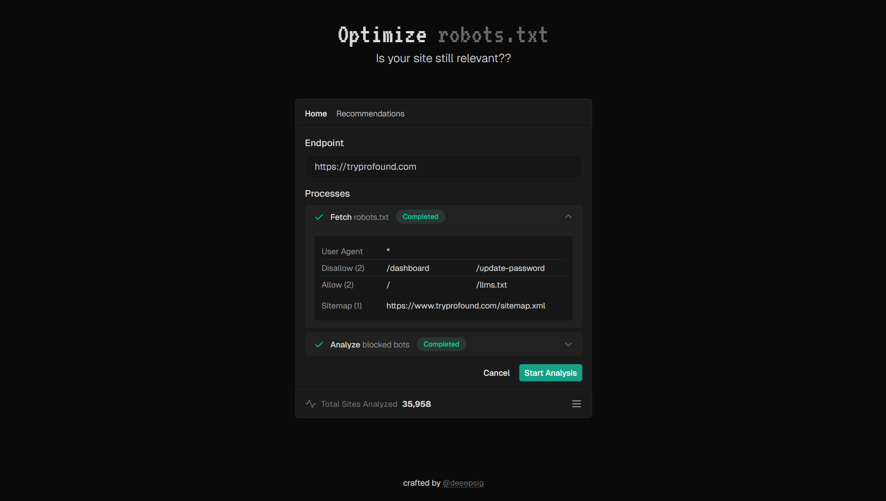
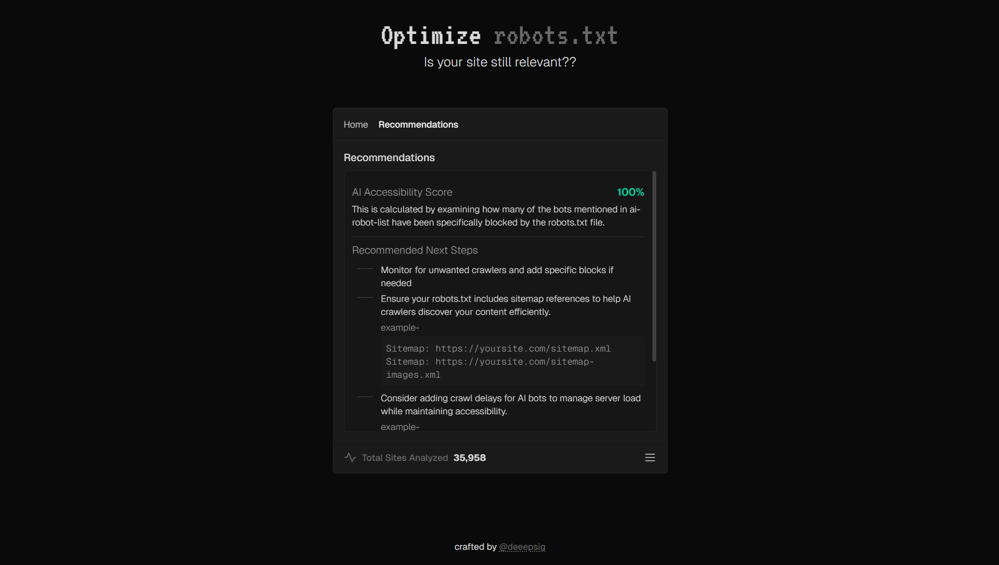

## AI Optimization Tool

A tool will allow users to assess how well their site's robots.txt file is optimized for AI-based crawlers, helping them improve their AI optimization strategies.



## Overview

Enter a website URL to analyze its robots.txt file and see which AI crawlers are blocked. The tool provides step-by-step analysis with recommendations for optimization.

### Application Flow

```
User Input → URL Validation → Fetch robots.txt → Parse Content →
AI Bot Analysis → Generate Recommendations → Display Results
```

### Component Hierarchy

```
Main
├── UrlInput
├── ProcessPanel
│   └── ProcessCard (x2)
│       ├── StatusBadge + IconComponent
│       └── CollapsibleContent
│           ├── RobotsTxtDisplay
│           └── AiBotAnalysisDisplay
├── ActionBar
└── RecommendationsPanel
    └── RecommendationsDisplay
```

### Data Flow

1. User enters URL → `validation.ts` validates input
2. User clicks analyze → `useRobotsQuery.ts` triggers API call
3. API fetches robots.txt → `robots.ts` parses content
4. `process-helpers.ts` analyzes against AI bots database
5. Results update UI through context and process steps
6. Recommendations display based on analysis results

## Deep Dive

This app can be essentialy divided into two kinds: UI only components and the components that handle how all these components can be used to give us a functional app.

### UI Components

- `UrlInput`: The `UrlInput` component renders a `Input` instance, and is responsible for enabling users to enter the url, and showcase an appropriate error message in case of when we enter a wrong url (validation is handled elsewhere, and we'll explain it later).
- `ProcessPanel`, `ProcessCard` and `CollapsibleContent`: In order ProcessPanel renders the processese in the form of processcard (two in our case for now), and the processcard basically has two parts, the top part that shows high level meta data about the process, and collapsiblecontent handles the actual content relevant to the process.
  - `StatusBadge`: This serves as a nice visual indicator alongside the `IconComponent` and uses `STATUS_CONFIG` to show an approrpiate indication. The iconcomponent is animated!
  - `RobotsTxtDisplay` and `AiBotAnalysisDisplay`: are the components that render inside the collapsiblecontent.
- `RecommendationsPanel`and `RecommendationsDisplay`: When we have the results based off of what we get from our utility, we consitionally render the Recommendation section using this in which `RecommendationsDisplay` shows us what the user needs to improve in their robots.txt file.
- `src/components/display/display-components.tsx`: This has a few common display components that are shared between `RobotsTxtDisplay`,`AiBotAnalysisDisplay` and `RecommendationsDisplay`.
- `ActionBar`: This renders two `Button` instances to be used as our main search handlers.

### Functionality



- `Main`: The central orchestration component that manages application flow and state coordination. It uses the `useAnalysis` context for view management, `useProcessSteps` for workflow tracking, and `useRobotsAnalysis` for robots.txt fetching through TanStack Query. The component handles form validation, user interactions, and conditionally renders the home or recommendations view based on application state.

- `useRobotsAnalysis`: A custom hook that extends `useRobotsQuery` with user-friendly methods like `canAnalyze` for URL validation and `startAnalysis` for manual query triggering. It provides an `isAnalyzing` flag mapped to the query's fetching state for loading indicators.

- `useAnalysis` (AnalysisProvider): A context provider managing global application state including view navigation, analysis results, and URL state. It centralizes shared state management with computed properties like `hasAnalysisResult` for result-dependent UI rendering.

- `useProcessSteps`: Manages the step-by-step process visualization throughout the analysis workflow. It handles adding, updating, and resetting process steps with specialized methods like `startFetchStep` and `updateFromRobotsResult` for coordinating between fetching and analysis phases.

- `isValidUrl`: A utility function providing comprehensive URL validation for robots.txt analysis. It handles various formats including localhost addresses, enforces HTTP/HTTPS protocols, and ensures URLs point to domain roots where robots.txt must be located.

- `fetchRobotsTxt` and `parseRobotsTxt`: Utilities for robots.txt retrieval and parsing. `fetchRobotsTxt` calls our internal API endpoint to handle CORS complexities, while `parseRobotsTxt` processes raw content into structured data with user agents, rules, and sitemaps.

- `analyzeRobotsTxt`: The core analysis logic that determines which AI bots are blocked by robots.txt files. It processes parsed data against known AI bots, handles wildcard rules, checks root path disallows, and returns structured analysis results.

- `API Route (/api/robots)`: A Next.js API endpoint handling server-side robots.txt fetching to bypass CORS restrictions. It normalizes URLs, fetches content with proper timeouts and headers, and returns structured JSON responses matching the `RobotsTxtResult` interface.

## Tech Stack

- **Next.js 14** with App Router - Full-stack React framework with server-side API routes for CORS-free robots.txt fetching
- **TypeScript** - Type-safe development across all components, hooks, and utilities
- **TanStack Query** - Data synchronization and caching for server state management
- **React Context API** - Global state management for view navigation and analysis results
- **Tailwind CSS** - Utility-first CSS framework for responsive, mobile-first design
- **Real-time Process Tracking** - Step-by-step visual feedback with animated status indicators

## Local Development

### Prerequisites

- Node.js 18+
- npm or yarn package manager

### Getting Started

1. **Clone the repository**

   ```bash
   git clone <https://github.com/deeepsig/aio-tool>
   cd aio-tool
   ```

2. **Install dependencies**

   ```bash
   npm install
   # or
   yarn install
   ```

3. **Start the development server**

   ```bash
   npm run dev
   # or
   yarn dev
   ```

4. **Open your browser**
   Navigate to [http://localhost:3000](http://localhost:3000) to see the application

### Testing the Application

- Enter any valid domain (e.g., `https://reddit.com` or `github.com`)
- Click "Start Analysis" to fetch and analyze the robots.txt file
- View the step-by-step process and results in real-time
- Check the recommendations panel for optimization suggestions

> [!NOTE]  
> This project is still under active development, but the main functionality works as intended! The core features for analyzing robots.txt files and providing AI bot blocking insights are fully operational.
>
> If you have suggestions for improvements or encounter any issues, please feel free to open an issue in the repository. Your feedback is greatly appreciated!
>
> I'll be doing a detailed writeup about the design decisions and engineering approach behind this tool later. This was an incredibly fun project to build!

## Resources and Design Inspirations

- [A list of AI agents and robots.](https://github.com/ai-robots-txt/ai.robots.txt) - Ibelick
- [Process card inspiration](https://www.prompt-kit.com/docs/tool)
- Linear
- Vercel
- John Pham
- Mariana Castilho

There are more which I'll update later.
